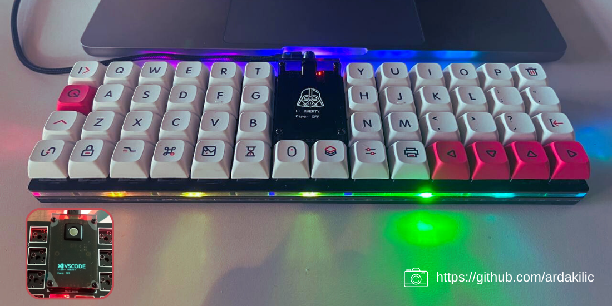

# YAKAMOZ

Yakamoz is a 50-key ortholinear keyboard, powered by a Raspberry Pi Pico. It consists of 1U keys with an OLED display, buzzer, trackball (optional) and RGB leds. It also supports hotswap, which means you can easily change with Cherry MX compatible switches

## Parts List and Build Guide
Please find detailed build instructions here: [https://ozkancelik.com/yakamoz/](https://ozkancelik.com/yakamoz/)

## Firmware

Github repository for YAKAMOZ QMK Firmware : [https://github.com/ozkan/Yakamoz-qmk](https://github.com/ozkan/Yakamoz-qmk)

You can fork my QMK repo which automatically builds firmware through GitHub Actions. Just fork this repository, enable GitHub Actions, and commit and see the firmware build as an artifact.

## Manufacturer
- [Main PCB Gerber ](https://github.com/ozkan/Yakamoz/tree/main/Production/MainPCB/Gerber)        
- [Switchplate Geber](https://github.com/ozkan/Yakamoz/tree/main/Production/SwitchpatePCB/Gerber)  

There are a lot of options here. I've personally used [PCBWay](https://pcbway.com/g/43w5U4) (Referral program link) to great success.

### Acknowledgements
PCBWay supports developers to try out creative board designs, thereby enhancing the development of the community and the hobby. Moreover, PCBWay’s boards have high quality, so I highly recommend their services.

 

<a href="https://pcbway.com" >Thanks PCBWay</a>

## License
This PCB design can be freely reproduced, modified and manufactured for personal use. 
The Yakamoz Keyboard is licensed under [Creative Commons Attribution-NonCommercial 4.0  International](https://creativecommons.org/licenses/by-nc/4.0/) License.    

 

My contact address is: [ozkan44celik@gmail.com](ozkan44celik@gmail.com)     
[ozkancelik@gmail.com](mailto:ozkancelik@gmail.com) 
